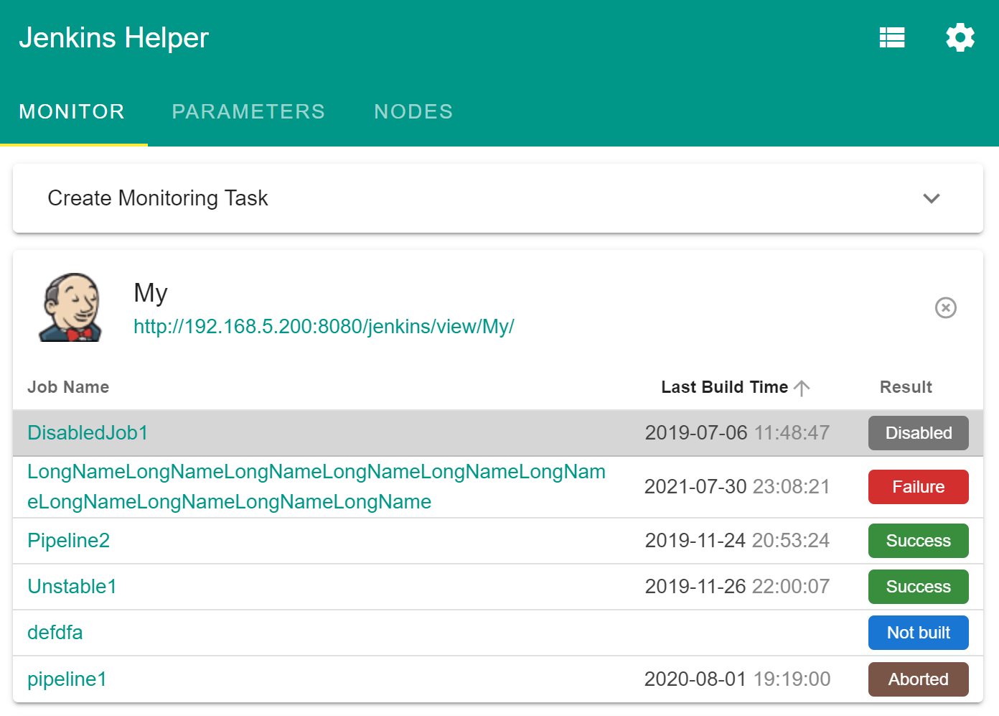
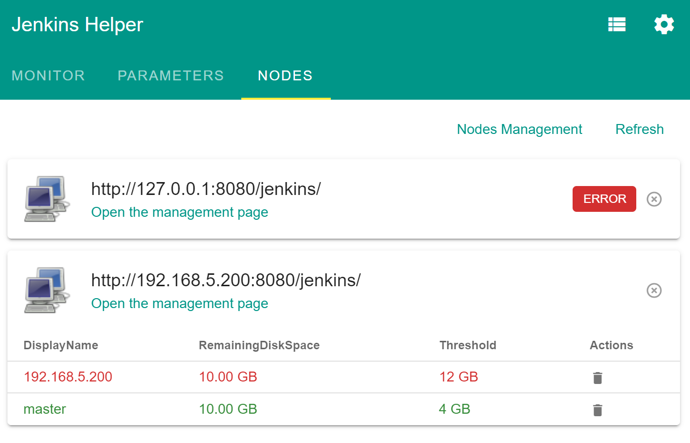
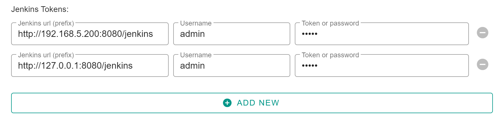

# Jenkins Helper   

一款能够极大地提高工作效率的 **Chrome/Firefox 浏览器扩展程序** 。

## 下载地址

### 在线安装

[Chrome Web Store](https://chrome.google.com/webstore/detail/jenkins-helper/lkjoiakaidioklnfdejmnoebfbjcbemh) / [Firefox Add-ons](https://addons.mozilla.org/addon/jenkins-helper/)

### 下载文件离线安装

[https://github.com/liying2008/jenkins-helper/releases](https://github.com/liying2008/jenkins-helper/releases)

**扩展离线安装方法：**

- **Chrome**：打开 `chrome://extensions` 页面，打开 **开发者模式** ，重启浏览器（`chrome://restart`），重新进入 `chrome://extensions` 页面，将crx文件拖至当前页面上即可。
- **Firefox**：将xpi文件拖至浏览器任一页面上即可。

## 功能介绍

该扩展程序可以：

1. **Job 监控**: 监控 Jenkins Job 的构建状态，构建完毕后显示通知。提供“监视器”界面，可以随时查看所关注的 Job 的构建状态。提供筛选功能，可根据构建结果筛选 Job。

> 注意：状态更新的频率以及通知频率可以在设置页更改。默认是60s更新一次状态，每次构建结束显示通知。

2. **构建参数查看**： 在每一个 Build 页面及其子页面下可方便快速查看构建信息以及构建参数。并提供查看上一次/下一次构建参数的按钮，可直接下载完整的构建日志到本地。

> 注意：只有在构建页面及其子页面下才有数据，其他页面显示 “**No Data**”。 如：`http://127.0.0.1:8080/jenkins/job/Pipeline2/4/` 是构建页面，`http://127.0.0.1:8080/jenkins/job/Pipeline2/4/console` 是子页面。  

> **支持 Blue Ocean 页面**。

3. **节点磁盘空间监控**: 监控 Jenkins 节点的磁盘空间大小，如果节点剩余空间大小小于或等于给定的阈值，则弹框告警。并提供“监视器”页面，可随时查看节点的剩余空间大小。

> 注意：状态更新的频率可以在设置页更改。默认是2小时更新一次状态，每次浏览器启动后会自动检查最新的状态。

4. **地址栏智能搜索**： 在地址栏输入 **`jk`**，按 <kbd>Space</kbd> 键进入 Jenkins Job 智能搜索模式，输入Job名称可快速匹配到对应的 Jenkins Job 链接。

> 注意：使用此功能需要提前在设置页配置好 **地址栏智能搜索（Omnibox Intelligent Search）** 。

5. **Job 统计**： 统计Job的 **运行节点** / **定时构建时间表** / **是否禁用** / **是否允许并发** 等信息。

> 注意：使用此功能需要提前在设置页配置好 **Job 统计设置（Job Statistics Settings）** 。

6. **参数暂存与恢复**： 在 **Build/Rebuild** 页面底部会生成两个按钮，分别是 **Stash Parameters** 和 **Recover Parameters**，点击 **Stash Parameters** 可以将当前页面填写的参数值保存起来，点击 **Recover Parameters** 可以将上次保存的参数值恢复到当前页面。

> 注意：每一次新保存的参数都会将之前保存的参数覆盖掉，即 **Stash Parameters** 只会保存**一份**参数值。   
> 支持 跨Job、跨Jenkins 使用，即 A Job 保存的参数可以恢复给 B Job 。

7. **自定义设置**： 可以针对自己的独特需求进行一些个性化的设置。

> 注意：更改设置之后，记得点击页面底部的 **保存设置（Save Settings）** 以应用更改。

## Tips

1. 为了让该扩展可以顺利访问 Jenkins API 而不依赖用户在 Jenkins 网站的登录状态，建议在设置界面配置 Jenkins 的 API Token ，如下图所示：

## Thanks

监视器界面（Monitor Page）布局参考了 [ggirou/yet-another-jenkins-notifier](https://github.com/ggirou/yet-another-jenkins-notifier) ，在此感谢。

## License

[MIT LICENSE](LICENSE)